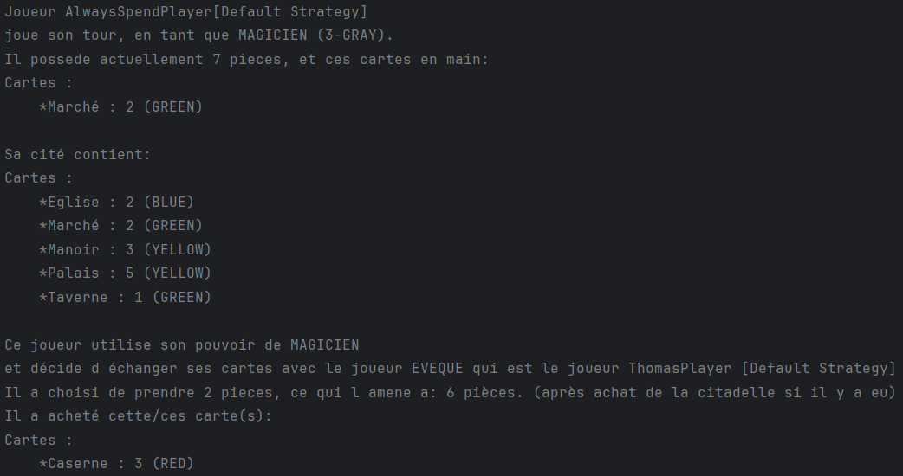

<h1 align="center">
   
  
   
  Citadelles : Groupe Q
   
</h1>

<h5 align="center">Citadelle, un jeu de société mêlant stratégie et bluff dans un décor médiéval fantastique. Les joueurs incarnent des personnages ambitieux construisant leur cité tout en contrant les plans de leurs adversaires.</h5>

  <a href="#notre-avancement">Notre avancement</a> •
  <a href="#architecture-et-qualité">Architecture et qualité</a> •
  <a href="#notre-processus-de-développement">Notre processus de développement</a> 

# Rapport final

## 1. Notre avancement

### A. Avancement du jeu
#### a. Ce qui a été fait
La plupart des fonctionnalités ont été intégrées dans le jeu,
garantissant ainsi une **couverture globale de ses fonctionnalités**. De même pour ce qui est des différents **pouvoirs des**
**cartes** ou des **rôles**. 

#### b. Ce qui n'a pas été fait
Il est important de noter que ces différents points ne sont pas présent dans notre implémentation :

- Nous ne gérons pas la **limite de pièces** sur une partie, qui est fixée à un maximum de 30.
- Les bots n'ont **pas de mémoires** et donc ne peuvent pas retenir les rôles.
- Lorsqu'un joueur récupère des pièces à l'aide de la couleur de son rôle et de ses cités, il **ne peut pas choisir**
de les obtenir **avant d'effectuer son tour** ou **à la fin de celui-ci** (pour potentiellement en obtenir plus suite 
- à l'achat d'une carte pendant le tour)

#### c. Nos choix d'affichage
Nous avons opté pour une approche simple en affichant les informations uniquement sur l'entrée standard. Lors de 
l'exécution d'une partie différentes informations sont affichées. Tel que :
- Le **numéro de tour**
- Le **type de bot** qui joue
- Les différentes **actions** et **choix du bot**
- La **stratégie** du bot
- Tous les événements liés à l'utilisation des **pouvoirs**
- Les **pièces** et les **cartes** en main et les cartes posées d'un joueur
- L'annonce du **vainqueur**

*Voici l'exemple de l'affichage lors d'un tour :*

### B. Avancement des statistiques et du CSV
Nous avons réalisé deux csv.

- [gamestatsdetails](gamestatsdetails.csv) a pour objectif de stocker en détails différentes statistiques important sur la partie d'un bot. Tel que :
  - Nom du joueur
  - Prix moyen des citadelles achetées
  - Rôle préféré
  - ...

    Il permet donc d'analyser précisément le comportment de nos bots sur plusieurs parties pour améliorer ses 
stratégies.

- [gamestats](gamestats.csv) a pour objectif de présenter de manière claire les performances de nos bots. En affichant le pourcentage 
de victoire, de défaite et de match nul.

### C. Avancement du bot demandé : “RichardPlayer”

Pour le bot Richard nous nous sommes basés sur les conseils de [Richard](https://forum.trictrac.net/t/citadelles-charte-citadelles-de-base/509) en implémentant les comportements qu’il aime prendre
au cours de la partie comme par exemple sa **stratégie offensive** quand un adversaire est sur le point de poser son avant-dernier 
quartier. Nous lui avons donné également un **comportement par défaut** qui correspond à la description de **« l’OPTIMISTE »** selon le 
deuxième utilisateur du forum car c’est selon lui le meilleur comportement. Nous avons choisis arbitrairement ses choix entre piocher 
des cartes ou prendre des pièces (car cela n’était pas indiqué).

### D. Nos meilleurs bots: “Matt” et “Thomas”

**TODO**

## 2. Architecture et qualité
### A. Architecture du code
*(Nous parlerons parfois de "joueur" dans cette partie, mais nous voulons bien dire par cela "logique de robot".)*

Notre architecture est divisée en plusieurs parties :
*  Le moteur de jeu:
    * Gestion de l’output ([GameOutputManager](src/main/java/fr/cotedazur/univ/polytech/citadellesgroupeq/GameOutputManager.java)), gestion du déroulement de la partie ([GameLogicManager](src/main/java/fr/cotedazur/univ/polytech/citadellesgroupeq/gamelogic/GameLogicManager.java), [RoundSummary](src/main/java/fr/cotedazur/univ/polytech/citadellesgroupeq/gamelogic/RoundSummary.java))
      et les classes d’éléments du jeu ([District](src/main/java/fr/cotedazur/univ/polytech/citadellesgroupeq/District.java), [Color](src/main/java/fr/cotedazur/univ/polytech/citadellesgroupeq/Color.java),
      [Role](src/main/java/fr/cotedazur/univ/polytech/citadellesgroupeq/Role.java), [CardDeck](src/main/java/fr/cotedazur/univ/polytech/citadellesgroupeq/CardDeck.java)).
*  Les bots/Player:
    * Une classe mère [Player](src/main/java/fr/cotedazur/univ/polytech/citadellesgroupeq/players/Player.java) avec des classes filles qui extend Player
      pour chaque type de bot ([ThomasPlayer](src/main/java/fr/cotedazur/univ/polytech/citadellesgroupeq/players/ThomasPlayer.java), [MattPlayer](src/main/java/fr/cotedazur/univ/polytech/citadellesgroupeq/players/MattPlayer.java)...).
* Les stratégies:
    * On a une interface `IStrategy` dont on se sert pour créer des classes stratégies qu’on utilise ensuite dans les bots.
* La dernière partie de l’architecture est là uniquement pour les calculs de statistiques ([BestScoreCalculator](src/main/java/fr/cotedazur/univ/polytech/citadellesgroupeq/playerevaluator/BestScoreCalculator.java), et les classes de CSV).

#### Le moteur du jeu:
* Notre classe [GameLogicManager](src/main/java/fr/cotedazur/univ/polytech/citadellesgroupeq/gamelogic/GameLogicManager.java)
  fonctionne dans cet ordre:
1. Elle génère une liste de joueurs, ou en prend une en paramètre, et crée une pioche partagée ([CardDeck](src/main/java/fr/cotedazur/univ/polytech/citadellesgroupeq/CardDeck.java)).
2. À chaque tour, elle génère une liste de rôles aléatoires, fait choisir à chaque joueur (à partir du maître du jeu) son rôle.
3. Elle fait jouer le tour de chaque joueur, par ordre de rôle.
4. Elle arrête la partie lorsqu'un joueur a atteint 8 citadelles.
* [RoundSummary](src/main/java/fr/cotedazur/univ/polytech/citadellesgroupeq/gamelogic/RoundSummary.java) est une classe qui va stocker et enregistrer tous les événements durant le tour du joueur.
* Cette classe est utilisée dans la classe [GameOutputManager](src/main/java/fr/cotedazur/univ/polytech/citadellesgroupeq/GameOutputManager.java). Grace à un `RoundSummary` la méthode [describePlayerRound()](src/main/java/fr/cotedazur/univ/polytech/citadellesgroupeq/GameOutputManager.java#L109) de `GameOutputManager` va pouvoir vérifier les évènements qui se sont déroulés et activer les bons logs.
  `GameOutputManager` contient d'autre méthode de description comme une description de la cité d'un joueur ou encore la description des roles disponibles au début du tour. La principale methode [startMainOutputLoop()](src/main/java/fr/cotedazur/univ/polytech/citadellesgroupeq/GameOutputManager.java#L33) déroule l'affichage de la partie du début à la fin.

#### Les `District` et les `Role`
Les `District` sont modélisés dans une classe. Ils possèdent un nom, un prix, une couleur, et optionnellement un nom de pouvoir (si ce sont des merveilles).
Nos rôles sont stockés dans un `Enum`, et possèdent une couleur ([Color](src/main/java/fr/cotedazur/univ/polytech/citadellesgroupeq/Color.java)), un nom, et un [pouvoir de rôle](src/main/java/fr/cotedazur/univ/polytech/citadellesgroupeq/Role.java#L167).

#### Les `Player` et les `Strategy`

Ce que nous appelons `Player` sont les classes représentant des bots !
Notre code est structuré ainsi:
* La classe abstraite mère [Player](src/main/java/fr/cotedazur/univ/polytech/citadellesgroupeq/players/Player.java) définit toutes les méthodes utilitaires attribuées à un bot:
  récupérer ses cartes en main [(getCardsInHand())](src/main/java/fr/cotedazur/univ/polytech/citadellesgroupeq/players/Player.java#L104), connaitre sa fortune [(getCash())](src/main/java/fr/cotedazur/univ/polytech/citadellesgroupeq/players/Player.java#L100), etc...
  Le `Player` possède un rôle, un accès à la pioche (classe [CardDeck](src/main/java/fr/cotedazur/univ/polytech/citadellesgroupeq/CardDeck.java)), son argent (`Player.Cash`), des cartes en main (`Player.cardsInHand`), et une cité (`Player.city`).
  Elle possède également une instanciation de stratégie. Détaillons:
* L'interface [IStrategy](src/main/java/fr/cotedazur/univ/polytech/citadellesgroupeq/strategies/IStrategy.java) liste les méthodes à Override pour changer le comportement d'un joueur. Entre autres:
    * [getChoosenCitadelToBuy()](src/main/java/fr/cotedazur/univ/polytech/citadellesgroupeq/strategies/IStrategy.java#L43) renvoie un Optional, contenant si désiré le district à acheter.
    * [selectAndSetRole()](src/main/java/fr/cotedazur/univ/polytech/citadellesgroupeq/strategies/IStrategy.java#L52), qui choisit parmi la liste des rôles disponibles le rôle que le bot choisira.
    * [selectDistrictToDestroyAsCondottiere()](src/main/java/fr/cotedazur/univ/polytech/citadellesgroupeq/strategies/IStrategy.java#L22), qui choisit le district à détruire si le bot est Condottière.

Le `Player` possède un attribut de type `IStrategy`, et peut le changer en milieu de partie. Nous avons donc plusieurs implémentations de stratégie, pouvant être modifiées en plein milieu de partie.
C'est un début modeste de *Strategy Pattern* (https://en.wikipedia.org/wiki/Strategy_pattern).

Précisons le fonctionnement de ce *Strategy Pattern*:

La classe `Player` (et donc toutes ses classes filles) implémentent l'interface `IStrategy`. Un `Player` possède donc une implémentation par défaut de `getChoosenCitadelToBuy()`, `selectRoleToSteal()`...

Mais les `Player` possèdent aussi un attribut privé `strategy` de type `IStrategy`. Nous avons fait en sorte que toutes les instances de `IStrategy` appelent par défaut les comportements codés dans la classe `Player`,
**sauf si leur comportement est redéfini dans cette stratégie** !

Nos joueurs possèdent donc:
* Une stratégie prioritaire, définissant les comportements à adopter, échangeable en pleine partie, grâce à l'attribut `strategy`
* Une stratégie par défaut si la stratégie prioritaire ne redéfinit pas tout, codée dans l'implémentation du `Player`

Exemple:
La stratégie [AimForMoneyStrategy](src/main/java/fr/cotedazur/univ/polytech/citadellesgroupeq/strategies/AimForMoneyStrategy.java) fait juste en sorte de ne rien acheter, et de choisir en priorité le rôle Voleur.
Elle n'implémente donc pas tous les comportements à prévoir (qui voler en tant que voleur ? qui tuer en tant qu'assassin ?).

Si [RandomPlayer](src/main/java/fr/cotedazur/univ/polytech/citadellesgroupeq/players/RandomPlayer.java) utilise une instance d'`AimForMoneyStrategy` en tant que `strategy`, il va utiliser en priorité les comportements décrits par cette stratégie (donc essayer de choisir le rôle voleur, et ne rien acheter),
mais il va utiliser son comportement codé par défaut pour le reste (par exemple, voler un joueur aléatoire en tant que voleur).

### B. Documentation du code
Notre code est documenté via une [java doc](file:///C:/Users/mat7t/Documents/fr/cotedazur/univ/polytech/citadellesgroupeq/players/package-summary.html). Le code est dans sa globalité bien commenté et documenté.

### C. Qualité du code
#### a. Parties en confiance

#### b. Parties à améliorer

#### c. Analyse de SonnarQube

## Notre processus de développement

## 3. Notre processus de développement
### A. Branching strategy: *Github Flow*
Nous avons décidé d'implémenter la branching strategy *Github flow*:

Avec cette stratégie, pour ajouter ou modifier une fonctionnalité, on crée une seule branche,
dans laquelle on commitera nos modifications, ainsi que nos tests et vérifications. Une fois qu'on
estime le travail fini, on *pull-request*, on laisse l'équipe vérifier le travail (et le corriger si nécessaire),
et on valide la pull-request, qui modifie alors la branche `master`.

Nos branches se nomment:
* `feature/nomdelajout` (avec `nomdelajout` un nom représentatif de l'ajout désiré), pour représenter une branche ajoutant une fonctionnalité
* `fix/nomdufix`, pour représenter un réglage de bug ou de problème
* `doc/nomdeladoc`, pour un ajout de documentation

#### Avantages et inconvénients de cette stratégie
Cette stratégie est très pratique et facile à mettre en place, tout en produisant un `master` stable.
Elle ne demande pas beaucoup de vérification, et de changements de branche et de pull-requests.

En revanche, elle assure une moins bonne stabilité du `master`: le code a subi moins de vérifications avant d'être merge.

### B. Utilisation des outils Github: issues, milestones, commits, PR
Nous avons délivré environ 1 milestone par semaine, celles-ci étaient toujours stables, testées et relues par les autres.
Nos milestones regroupaient entre 5 et 15 issues par semaine, labelisées, et réparties à chaque membre au fil de la semaine
sur notre Discord.

Nous avons globalement respecté les règles des *conventional commits*, en préfixant nos commit et en référençant les issues
qu'ils impactaient.

Toutes nos branches ont été *merge* par des *pull-requests*. Nous nous sommes permis de les accepter nous-même si les fonctionnalités étaient petites,
ou que nous nous étions mis d'accord pour le faire.

### C. Répartition du travail
Tout le monde a participé aux fonctionnalités. Chaque membre a fait au moins un peu de tests, de codages de merveilles, de rôles...

Mathias et Romain, en plus du code, sont principalement responsables de la réflexion autour des stratégies: quelles stratégies implémenter pour gagner ?
Comment choisir les citadelles à acheter ? 

Gauthier, en plus du code, a mené la division du projet en issues et milestones, et a contribué à la réflexion autour des responsabilités
de chaque classe. Il a proposé la majorité de la structure et des classes à implémenter.
